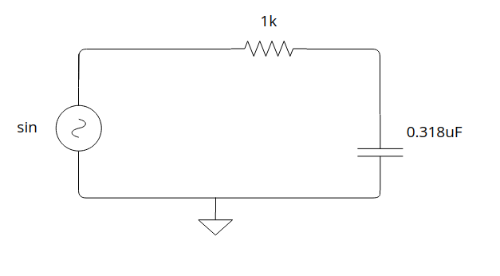
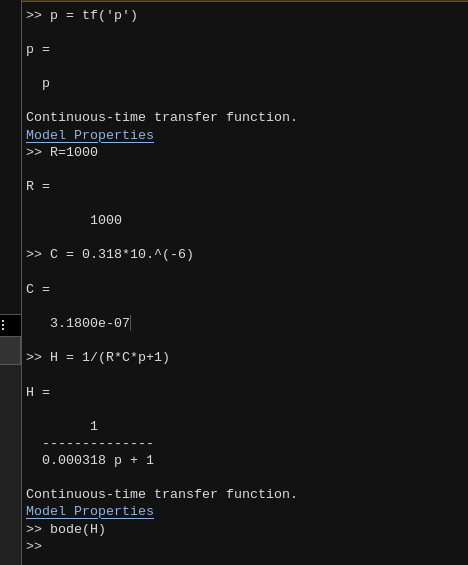
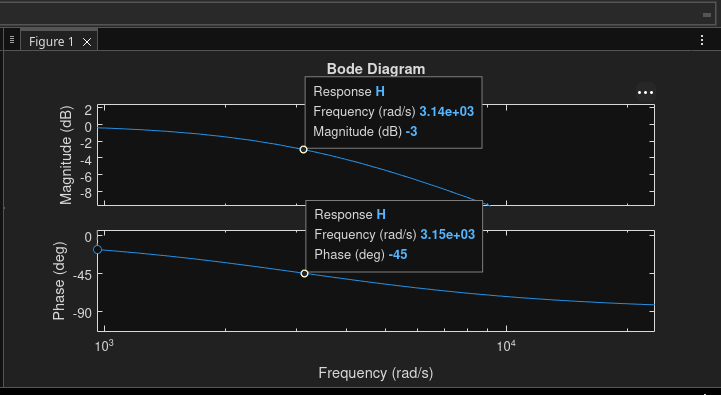
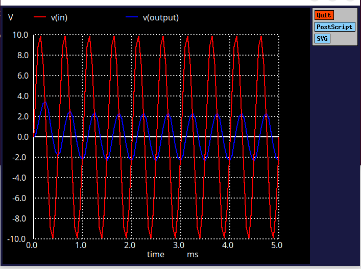
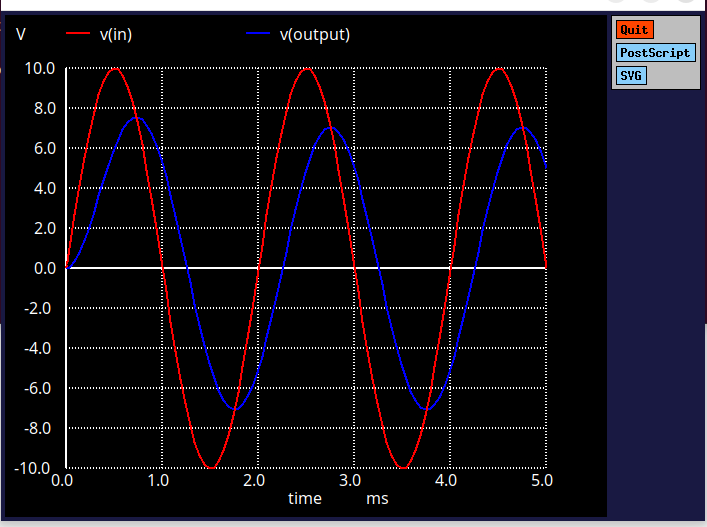
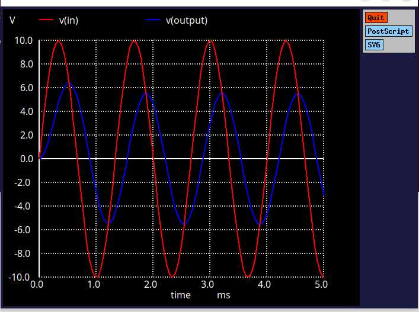
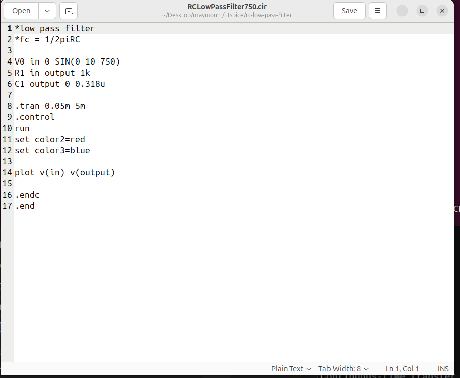

<!-- Logo / Banner -->
<p align="center">
  
</p>

<!-- Badges -->
<p align="center">
  
  
  
  
</p>

# RC Low-Pass Filter — SPICE & MATLAB Analysis

This project applies circuit design knowledge and SPICE netlist coding to design and analyze a **low-pass RC filter** with a cutoff frequency of **500 Hz**, based on:

```
fc = 1 / (2πRC)
```

The goal was to validate the design through three independent methods: hand-derived mathematics, MATLAB frequency-response analysis, and ngspice transient simulation — confirming all three agree.

<!-- Demo GIF -->
<p align="center">
  
</p>

## 📐 Circuit

```
Vin (sine source) → R1 (1kΩ) → output node → C1 (0.318µF) → ground
```


*Schematic of the RC low-pass filter: 1kΩ resistor in series, 0.318µF capacitor to ground at the output.*

## 🧮 Mathematical Derivation

**Step 1 — Kirchhoff's Voltage Law + capacitor i-v relationship:**
```
RC·(dVout/dt) + Vout(t) = Vin(t)
```

**Step 2 — Apply the Laplace Transform** (zero initial conditions):
```
RCs·Vout(s) + Vout(s) = Vin(s)
```

**Step 3 — Transfer function:**
```
H(s) = Vout(s)/Vin(s) = 1 / (1 + RCs)
```

**Step 4 — Frequency response** (substitute s = jω):
```
H(jω) = 1 / (1 + jωRC)
|H(jω)| = 1 / √(1 + (ωRC)²)
```

**Step 5 — Cutoff frequency** (solve for the half-power point, |H| = 1/√2):
```
fc = 1 / (2πRC) ≈ 500 Hz
```

### Why 1/√2?
The cutoff is defined as the **half-power point**, not an arbitrary voltage ratio. Since power is proportional to voltage squared (P = V²/R), requiring half the power to pass through means:
```
(Vout/Vin)² = 1/2  →  Vout/Vin = 1/√2
```
This is equivalent to the standard **-3dB point** used across all filter design.

## 📊 MATLAB Bode Analysis

```matlab
p = tf('p')
R = 1000
C = 0.318*10.^(-6)
H = 1/(R*C*p+1)
bode(H)
```





The Bode plot confirms the theoretical prediction: at ω ≈ 3.14×10³ rad/s (which is 2π×500 — exactly the calculated fc), the magnitude has dropped to **-3dB** and the phase is at **-45°**, matching the derivation above precisely.

## ⚡ SPICE Simulation (ngspice)

### Installing ngspice

```bash
sudo apt update
sudo apt install ngspice
```

### Netlist files

Each frequency test is its own `.cir` file, following the naming pattern `RCLowPassFilter<freq>.cir`. Only the `SIN(...)` frequency value changes between them.

**Example — `RCLowPassFilter750.cir`:**
```spice
*low pass filter
*fc = 1/2piRC
V0 in 0 SIN(0 10 750)
R1 in output 1k
C1 output 0 0.318u
.tran 0.05m 5m
.control
run
set color2=red
set color3=blue
plot v(in) v(output)
.endc
.end
```


### How to open and run it in the terminal

Navigate to the folder containing the `.cir` file, then run:
```bash
cd rc-low-pass-filter
ngspice RCLowPassFilter750.cir
```
This launches ngspice, runs the transient simulation automatically (via the `.control`/`run` block), and opens a plot window showing `v(in)` vs `v(output)`.

### Results across frequencies

### Results across frequencies

**250Hz (below cutoff):**


**500Hz (at cutoff):**


**750Hz (above cutoff):**


**2000Hz (well above cutoff):**




## 📈 Results Summary

| Frequency | Method | Peak Output | Matches Theory? |
|---|---|---|---|
| 250 Hz | ngspice | ~9.7V | ✅ |
| 500 Hz | ngspice | ~7.07V (cutoff, -3dB) | ✅ |
| 750 Hz | ngspice | ~5.55V | ✅ |
| 2000 Hz | ngspice | ~2.43V | ✅ |
| — | MATLAB Bode | -3dB @ 500Hz | ✅ |

## 🛠️ Installation & Usage

```bash
git clone https://github.com/maymoun1235/rc-low-pass-filter.git
cd rc-low-pass-filter
ngspice rc500.cir
```

## 📚 What I Learned

- Derived the RC low-pass transfer function from first principles (KVL → ODE → Laplace)
- Understood why the -3dB / 1/√2 cutoff convention exists (half-power point)
- Validated theoretical predictions against both MATLAB and SPICE simulation
- Practiced ngspice netlist syntax, plotting, and basic scripting

## 🤝 Contributing

This is a personal learning project, but suggestions and corrections are welcome — feel free to open an issue or a pull request.

## 📄 License

This project is licensed under the MIT License — see the [LICENSE](LICENSE) file for details.

## ☕ Support

If this helped you learn something, consider starring the repo — it helps more than you'd think.

<p align="center">
  <a href="https://www.buymeacoffee.com/yourname">
    
  </a>
</p>
